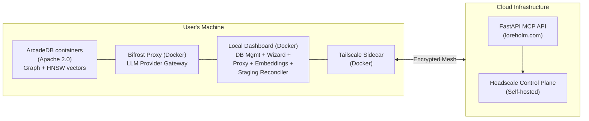

# loreholm

**loreholm** is a memory proxy for LLM conversations built around the **Model Context Protocol (MCP)**.

It is implemented as a **BYODB (Bring Your Own Database) MCP service** with **zero-SSH CI/CD deploys**, designed to persist, retrieve, and inspect structured memories derived from LLM chats.

At its core, loreholm is a **tool for thinking** — not an autonomous agent and not a black box.

---

## What loreholm does

loreholm provides a structured, inspectable way to:

- Store human-readable memories derived from LLM conversations
- Link those memories to entities (people, projects, tools, concepts)
- Retrieve relevant context to ground future conversations
- Keep humans in control of what is remembered and why
- **Run your own database locally** while connecting to the cloud API
- **Manage databases from a local dashboard** with an AI-powered setup wizard
- **Bring your own AI provider** (OpenAI, Anthropic, Google, Groq, or local Ollama) via Bifrost

All memory interaction happens through **explicit MCP tools**.
There are no hidden background writes or implicit memory mutation.

---

## Architecture (BYODB)



### Key characteristics

- **BYODB**: Your database runs locally, you own your data
- **MCP-first**: LLMs interact via tools, not internal APIs
- **Graph-backed**: ArcadeDB stores entities, memories, relationships, staging
- **Inspectable**: every memory has provenance and confidence; LLM-proposed writes pass through an auditable staging reconciler before they commit
- **Secure**: Tailscale mesh provides encrypted, isolated access
- **Deployable**: containerized, CI/CD-driven, no manual SSH
- **AI-assisted**: local dashboard includes a wizard agent for database setup and schema design
- **Multi-provider**: Bifrost gateway supports OpenAI, Anthropic, Google, Groq, and Ollama

---

## Documentation (3-min reads)

Read in order:

1. **[Architecture](docs/01_Architecture.md)** - System overview and BYODB design
2. **[ArcadeDB Setup](docs/02_ArcadeDBSetup.md)** - Database configuration and connection
3. **[MCP Tools](docs/03_McpTools.md)** - API tool reference and usage patterns
4. **[Vector Search](docs/04_VectorSearch.md)** - How semantic search works
5. **[Cypher Queries](docs/05_CypherQueries.md)** - Example queries for inspection
6. **[Tool Schemas](docs/06_ToolSchemas.md)** - Complete MCP tool schema definitions
7. **[BYODB Architecture](docs/07_BYODB.md)** - How user-owned databases work
8. **[Frontend Setup](docs/08_FrontendSetup.md)** - Web dashboard and OIDC auth
9. **[Headscale Setup](docs/09_HeadscaleSetup.md)** - Private networking setup
10. **[Onboarding API](docs/10_OnboardingAPI.md)** - User registration endpoints
11. **[API Key Auth](docs/11_ApiKeyAuth.md)** - PASETO-based API key authentication
12. **[AI Model Integration](docs/12_AIModelIntegration.md)** - MCP protocol and REST integration
13. **[Trust Model & Security](docs/13_SecurityModel.md)** - What the cloud can and cannot reach, and how to verify it
14. **[Next Steps & Roadmap](docs/07_NextSteps.md)** - Planned work, including the Connection & Security panel

---

## CI/CD philosophy (IMPORTANT)

loreholm follows a **container-first, zero-SSH deployment model**.

There are **no manual server mutations**.

### CI/CD flow

1. Push or pull request → GitHub Actions runs the test suite (`.github/workflows/ci.yml`)
2. Push to `main` → Actions builds and publishes the public images:
```

ghcr.io/<owner>/mcp-api:latest          (+ :<sha>)
ghcr.io/<owner>/mcp-local-dashboard:latest   (+ :<sha>, amd64 + arm64)

```
3. Deployment of the hosted service happens from a separate private
   infrastructure repository that pins image tags published here. Nothing
   in this repository can touch production, and no workflow here uses any
   secret beyond its own `GITHUB_TOKEN`.

This ensures:
- Reproducible deployments — the image you run is built in the open from the source you can read
- No configuration drift
- Clear rollback paths (every commit on `main` has a pullable image tag)

---

## Configure production compose

Edit `deploy/docker-compose.prod.yml` and set:
- `YOUR_GITHUB_USER_OR_ORG` for container image
- `GRAPH_STORE_BACKEND` (defaults to `arcadedb`)

See [02_ArcadeDBSetup.md](docs/02_ArcadeDBSetup.md) for connection details.

## Self-hosting on your own domain

loreholm is not tied to `loreholm.com` — bring your own domain. Two layers of
configuration:

- **Runtime (the API image)** reads everything domain-related from env:
  `OIDC_ISSUER` / `OIDC_CLIENT_ID` / `OIDC_AUDIENCE` for auth,
  `CORS_ALLOWED_ORIGINS` (CSV) for the browser apps, `PUBLIC_API_HOST` for
  install commands, and `HEADSCALE_DOMAIN` for the mesh control plane. The
  dashboard and chat front-ends resolve their config at runtime, so they carry
  no hardcoded host.
- **Deploy templates** (`deploy/nginx.conf`, `deploy/headscale-config.yaml`,
  `web/install.*` / `web/update.*`) carry `__APP_DOMAIN__` / `__API_DOMAIN__` /
  `__CHAT_DOMAIN__` / `__OIDC_ISSUER_ORIGIN__` placeholders that your deploy
  pipeline substitutes (the reference pipeline derives them from a single
  `BASE_DOMAIN`).

See [web/Config.md](web/Config.md) for the OIDC setup and the full env list.

---

## Local development (venv)

For local iteration without containers:

```bash
cd api
python3 -m venv .venv
. .venv/bin/activate
pip install -r requirements.txt -r requirements-dev.txt
fastapi dev app/main.py --host 0.0.0.0 --port 8080
````

This runs the MCP API locally while pointing to a reachable local dashboard (and through it, the ArcadeDB backend).
ArcadeDB connectivity notes live in [docs/02_ArcadeDBSetup.md](docs/02_ArcadeDBSetup.md).

---

## MCP tool endpoints (POC)

See [02_ArcadeDBSetup.md](docs/02_ArcadeDBSetup.md) for connection configuration.

- `POST /mcp/loreholm_upsert_entities`
- `POST /mcp/loreholm_write_memory`
- `POST /mcp/loreholm_link_entities`
- `POST /mcp/loreholm_delete_entities`
- `POST /mcp/loreholm_search`
- `POST /mcp/loreholm_context`
- `POST /mcp/loreholm_recent`
- `POST /mcp/loreholm_stats`

These routes proxy through the local dashboard's `POST /api/sync/query` endpoint to the user's ArcadeDB container.

### Optional auth

Set `AUTH_TOKEN` in the environment to require a bearer token on MCP routes.
Clients can send either:

- `Authorization: Bearer <token>`
- `X-Auth-Token: <token>`

---

## Tests

```bash
cd api
. .venv/bin/activate
PYTHONPATH=api pytest api/tests
```

Tests focus on:

* MCP tool behavior
* Memory writes and retrieval
* Deterministic, inspectable outputs

---

## Design principles (TL;DR)

* Explicit over implicit
* Inspectable over magical
* Structured over clever
* Reversible over permanent

If a memory can’t be explained later, it doesn’t belong in the database.

---

## Project status

loreholm is under active development.

Current capabilities:

* MCP-based memory ingestion and retrieval
* Deterministic vector search and context retrieval
* Local dashboard with AI-powered database setup wizard
* Multi-provider LLM support via Bifrost (OpenAI, Anthropic, Google, Groq, Ollama)
* User account authentication with password management
* Multi-database management from the local dashboard
* API key management for external agent access

---

## What loreholm is NOT

* ❌ An autonomous agent brain
* ❌ A hidden surveillance memory
* ❌ A black-box vector store
* ❌ A rigid ontology experiment

loreholm exists to help **humans and LLMs think together**, not to replace human judgment.

---

## License

loreholm is fully open source, under two licenses drawn along the trust boundary:

| Component | Path | License |
|---|---|---|
| Cloud API, MCP server, local dashboard server, reconciler | `api/` | [AGPL-3.0](LICENSE) |
| Web dashboard, installers, update scripts, endpoint shim | `web/` | [MIT](web/LICENSE) |
| Chat front-end | `apps/chat/` | [MIT](apps/chat/LICENSE) |
| Everything else (deploy configs, scripts, docs) | repository root | [AGPL-3.0](LICENSE) |

The split is deliberate: the server-side engine is AGPL so no one can take it,
modify it, and offer it as a closed hosted service. The client-side on-ramps
are MIT so anyone can embed, adapt, and redistribute them without legal review.

Contributions are welcome — see [CONTRIBUTING.md](CONTRIBUTING.md). They
require agreeing to the [Contributor License Agreement](CLA.md),
which preserves the project's ability to offer commercial AGPL exemptions —
the project's only monetization. **These licenses govern code, never data.
Your memory data is yours alone — to own, to know, and to control.**
