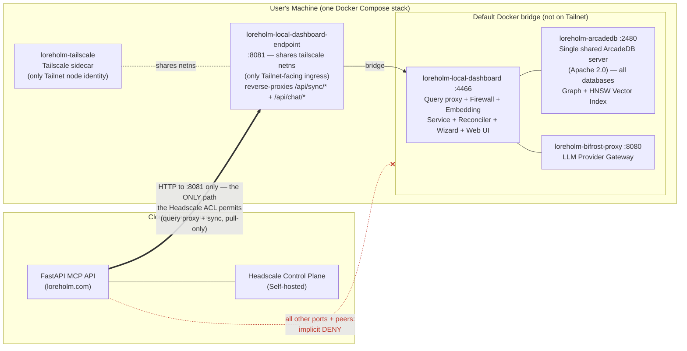
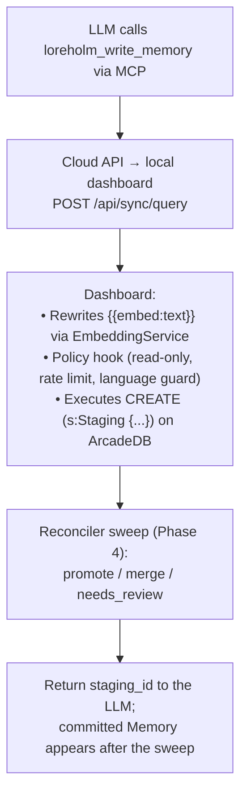
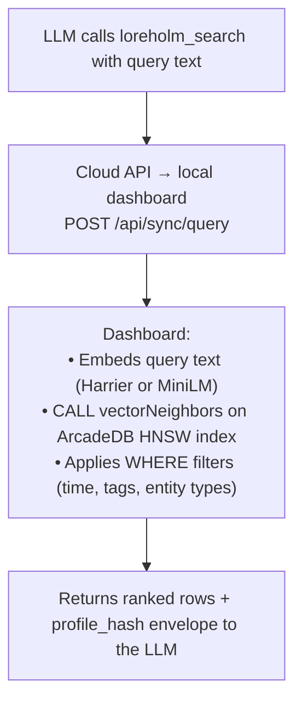

# Architecture (3 min read)

loreholm is a memory proxy for LLM conversations built around the Model Context Protocol (MCP).

## Architecture

loreholm runs a single architecture: **BYODB (Bring Your Own Database)**.
Each user runs their own database on their own machine; the cloud never
stores user data and never connects to the database directly.



> **Trust boundary.** The Headscale ACL (`deploy/headscale-acl.hujson`) lets
> `group:api` reach `*:8081` and nothing else; every other port and every
> host-to-host path is denied by the implicit-deny rule. This is enforced in
> depth: (1) the ACL permits only `:8081`; (2) only the shim is in the
> Tailscale netns, so `:2480`/`:8080`/`:4466` are never bound to the Tailnet
> interface at all; (3) the shim itself forwards only `/api/sync/*` and
> `/api/chat/*`. Any one layer regressing still leaves the other two.

- **One shared ArcadeDB server per machine.** A single
  `loreholm-arcadedb` container holds every database the user creates;
  per-database lifecycle is HTTP (`CREATE DATABASE` / `DROP DATABASE`)
  against that one server. There are no per-database containers and no
  Docker socket. ArcadeDB lives on the default Compose bridge — **not**
  in the Tailscale netns — so `:2480` is unreachable from the Tailnet
  regardless of ACL state.
- **The `:8081` endpoint shim is the only Tailnet-facing ingress.** It
  shares the `loreholm-tailscale` container's network namespace (the only
  thing on the machine with a Tailnet IP), serves `/healthz` and
  `/local-dashboard.json` locally, and reverse-proxies `/api/sync/*`
  (cloud→local pull) and `/api/chat/*` (chat app proxy) to the dashboard
  over the bridge. It relays the sync bearer token unmodified; the
  dashboard verifies it.
- **The local dashboard is the query proxy and firewall.** It is the
  only process that talks to the ArcadeDB HTTP API (over the bridge as
  `loreholm-arcadedb:2480`). Its `:4466` port is published to the LAN bind
  host, not the Tailnet. Every cloud MCP request arrives via the shim as
  Cypher to `POST /api/sync/query`; the dashboard rewrites
  `{{embed:<param>}}` placeholders with vectors from its on-host
  `EmbeddingService`, runs the firewall hook (read-only enforcement,
  per-key rate limits, a Cypher language guard, user-authored policy
  rules), executes against the target database, and returns rows plus
  `profile_hash` in the response envelope.
- **A staging reconciler runs inside the dashboard process.**
  LLM-proposed writes land as `Staging` vertices; the reconciler sweeps
  them on a timer and decides merge / promote / needs_review per
  cosine-distance thresholds, using ArcadeDB's HNSW index for dedup
  lookups.
- **Cloud reaches the machine over the Headscale-managed Tailnet** to
  the `:8081` shim; the cloud never opens a connection to ArcadeDB.
- **Auth0** handles user authentication for the cloud API.
- **Bifrost** proxies LLM requests to configured AI providers (OpenAI, Anthropic, Google, Groq, Ollama).

## Key Design Principles

### 1. **BYODB-First**
Users own and control their data. Databases run locally on user machines and connect via encrypted Tailscale mesh. The API never stores user data directly.

### 2. **MCP-First** 
All memory operations happen through explicit MCP tool calls:
- `loreholm_upsert_entities` - Create/update entities
- `loreholm_write_memory` - Store memories with embeddings
- `loreholm_search` - Vector + text search
- `loreholm_context` - Get entity context
- `loreholm_link_entities` - Create relationships
- `loreholm_delete_entities` - Delete entities (and detach edges)
- `loreholm_recent` - Recent memories
- `loreholm_stats` - Database statistics

### 3. **Reference-Based Routing**
API keys can route through reusable per-user database targets:
- Multiple API keys can share one named target
- New keys store a target reference claim (`db_ref`) instead of embedding full DB config
- Legacy embedded key payloads are still supported for compatibility

### 4. **Pull-Only Local Dashboard**
The local dashboard on a user's machine is a passive HTTP server from the
cloud's perspective. All cloud ↔ local synchronization is initiated by the
cloud over Tailscale, using a shared bearer token. The local dashboard
never originates outbound HTTP to the cloud API. This preserves the trust
boundary: a compromised BYODB node cannot reach cloud endpoints as its
user, and end-user firewalls that block outbound traffic from local
databases are supported by default.

Staleness detection is a byproduct of serving queries rather than a
background poll: every query response includes `profile_hash` in its
envelope, and the cloud does a resolve-and-retry on mismatch. See
`docs/07_BYODB.md` §7 for the full query-proxy + sync design.

### 5. **Graph-Backed**
ArcadeDB stores:
- **Entities**: People, projects, tools, concepts (committed)
- **Memories**: Text observations with confidence and provenance (committed)
- **Relationships**: How entities relate to each other (`RELATED_TO`, `MENTIONS`, `ABOUT`, `HAS_MESSAGE`, `DERIVED_FROM`)
- **Staging**: LLM-proposed writes awaiting the reconciler's merge/promote/review decision
- **Embeddings**: Semantic vectors indexed by `LSM_VECTOR` HNSW on `Entity`, `Memory`, and `Staging`

### 6. **Vector-First Search**
Search strategy:
1. Dashboard embeds the query text via `EmbeddingService` (Harrier-270M or MiniLM-L6-v2).
2. Cypher runs `CALL vectorNeighbors('Memory[embedding]', embedding, $limit)` against ArcadeDB's HNSW index.
3. Post-filters (time, tags, entity types) are applied in the same query.
4. Results are ranked by `(1.0 - distance)` similarity + timestamp.

No traditional text matching needed — semantic search finds relevant memories based on meaning.

## Technology Stack

- **API**: FastAPI (Python)
- **Database**: ArcadeDB (Apache 2.0) — one shared server container per machine holding all of the user's databases, with built-in HNSW vector indexes
- **Client**: `httpx` against ArcadeDB's HTTP `/api/v1/command/{database}` endpoint
- **Embeddings**: dashboard-side `EmbeddingService` (Harrier-270M 640-dim primary, MiniLM-L6-v2 384-dim fallback)
- **LLM Gateway**: Bifrost (OpenAI-compatible proxy for multi-provider LLM access)
- **Supported LLM Providers**: OpenAI, Anthropic, Google (Gemini), Groq, Ollama (local)
- **Authentication**: Auth0 (JWT tokens) for cloud API; password-based auth for local dashboard
- **API Key Metadata/Revocation**: Redis
- **Database Target Registry**: Postgres
- **Networking**: Tailscale + Headscale (private mesh)
- **Frontend**: Vanilla HTML/CSS/JS (no build tools)
- **Deployment**: Docker + GitHub Actions + Watchtower

## Repository Structure

```
api/                    # FastAPI application
  app/
    main.py            # FastAPI entry point
    mcp/               # MCP tool routes
    onboarding/        # User onboarding & Auth0 integration
    local_dashboard/   # Local dashboard API + wizard agent
      main.py          # Dashboard endpoints, auth, Bifrost, wizard
      static/          # Frontend (HTML, JS, CSS)
    llm/               # LLM routing (Bifrost proxy)
    services/          # Graph store layer (ArcadeDBStore via /api/sync/query proxy)
  tests/               # API tests
web/                   # Static frontend + install scripts
  index.html           # Landing page
  dashboard.html       # User dashboard
  install.sh           # BYODB install script (Linux/macOS)
  install.ps1          # BYODB install script (Windows)
  update.sh            # Update script (Linux/macOS)
  update.ps1           # Update script (Windows)
  js/                  # Auth0 & dashboard logic
deploy/                # Production docker-compose
  docker-compose.headscale.yml  # Headscale control plane
docs/                  # Documentation (you are here)
.github/workflows/     # CI + public image publishing (deploys live elsewhere)
```

## Data Flow Example

**Writing a memory:**



**Searching memories:**



## Security Model

### Cloud / Tailnet boundary
- **Auth0 JWT validation** for all cloud API authenticated routes
- **Per-user dashboard isolation** via Tailscale ACLs (Headscale enforces
  per-user reachability of each machine's `:8081` endpoint node)
- **Optional per-key target routing** via server-side database target references
- **Headscale ACLs** prevent users from reaching other users' machines
- **Only the `:8081` endpoint shim is exposed on the Tailnet.** ArcadeDB
  (`:2480`) and Bifrost (`:8080`) live on the default Docker bridge and
  are unreachable from the Tailnet regardless of ACL state; the dashboard
  (`:4466`) is published to the LAN bind host, not the Tailnet
- **Cloud-originated queries pass the local firewall hook** (read-only
  enforcement, per-key rate limits, Cypher language guard, user policy
  rules) before they touch ArcadeDB

### Local Dashboard
- **Bootstrap token** for initial access (generated at install, shown once)
- **Username/password authentication** after account setup (PBKDF2-SHA256)
- **Session cookies** for browser access (signed, httponly, configurable TTL)
- **API key auth** for external agent access (`Authorization: Bearer <key>`)
- **Sync bearer token** for cloud-to-local communication, relayed unchanged by the `:8081` shim and verified by the dashboard

## What loreholm Is NOT

- ❌ An autonomous agent brain
- ❌ A hidden surveillance memory
- ❌ A black-box vector store
- ❌ A rigid ontology experiment

loreholm exists to help **humans and LLMs think together** through explicit, inspectable memory operations.
