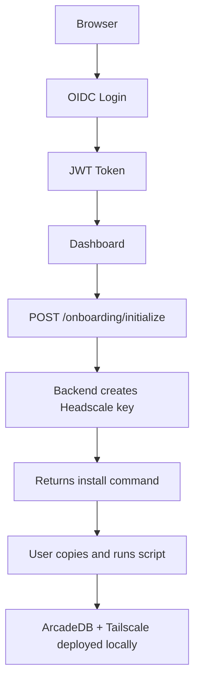

# Frontend Setup (3 min read)

The loreholm web frontend provides user onboarding and dashboard functionality.

## Structure

```
web/
├── index.html          # Landing page with pricing
├── dashboard.html      # Authenticated user dashboard
├── docs.html           # Documentation browser
├── install.sh          # BYODB install script
├── install.ps1         # BYODB install script (Windows)
├── Config.md           # Configuration instructions
├── css/
│   └── style.css       # Clean, minimal styles
└── js/
    ├── config.js       # OIDC and API configuration
    ├── auth.js         # OIDC integration (oidc-client-ts)
    └── dashboard.js    # Dashboard functionality
```

## Key Features

### Landing Page (`index.html`)
- Hero section with value proposition
- Feature grid explaining the BYODB flow
- Pricing card ($9/month)
- Sign up / Sign in buttons

### Dashboard (`dashboard.html`)
- OIDC protected route
- Initialize onboarding flow
- Display install command with copy button
- Show connection status
- Regenerate install keys
- Access to ArcadeDB Studio (via the local dashboard "Open Database Studio" button)
- Resolve and open the user's LAN dashboard URL via API at runtime

## Authentication Flow



## Configuration

### 1. OIDC Setup

loreholm works with any OIDC provider (Auth0, Keycloak, Zitadel, Authentik,
Google, …). See [web/Config.md](../web/Config.md) for detailed instructions.

**Quick steps:**
1. Create a public OIDC client (Authorization Code + PKCE)
2. Set callback URLs to `https://example.com/dashboard`
3. Define the API audience `https://api.example.com`
4. Provide the issuer, Client ID, and Audience via the API's environment
   (the frontend fetches them at runtime from `/onboarding/auth/config`)

### 2. Update `web/js/config.js` (optional fallback)

Values are normally served at runtime; fill these in only as a static fallback:

```javascript
window.APP_CONFIG = {
    oidc: {
        issuer: 'https://YOUR_ISSUER',
        clientId: 'YOUR_CLIENT_ID',
        audience: 'https://api.example.com',
        redirectUri: window.location.origin + '/dashboard',
        scope: 'openid profile email'
    },
    api: {
        baseUrl: window.location.origin,
    }
};
```

### 3. GitHub Secrets

Add to your repository secrets:
- `OIDC_ISSUER`
- `OIDC_CLIENT_ID`
- `OIDC_AUDIENCE`
- `OIDC_AUDIENCE_CLAIM` *(optional, set to `azp` if your provider uses it)*
- `HEADSCALE_API_URL`
- `HEADSCALE_API_KEY`

## Local Development

```bash
# Serve static files
python3 -m http.server 8000 --directory web

# Visit http://localhost:8000
```

Note: login won't work locally without configuring `http://localhost:8000` as an allowed callback URL in your OIDC provider.

## Platform Install Commands

Linux / macOS:
```bash
curl -fsSL https://example.com/install.sh | bash -s -- --key YOUR_KEY
```

Windows (PowerShell):
```powershell
irm https://example.com/install.ps1 | iex
```

## Design Philosophy

**No Build Tools Required:**
- Pure HTML/CSS/JavaScript
- oidc-client-ts loaded from CDN
- Edit and deploy instantly
- No npm, webpack, or bundlers

**Minimal & Clean:**
- ~500 lines of CSS total
- Vanilla JS - easy to understand
- No framework lock-in
- Fast page loads

## API Integration

The frontend calls these backend endpoints:

| Endpoint | Purpose |
| --- | --- |
| `POST /onboarding/initialize` | Create user and generate install key |
| `GET /onboarding/status` | Check connection status |
| `GET /onboarding/local-dashboard/resolve` | Resolve LAN dashboard URL from BYODB node metadata |
| `GET /install.sh` | Download install script |
| `GET /install.ps1` | Download install script (Windows) |
| `GET /update.sh` | Download update script |
| `GET /update.ps1` | Download update script (Windows) |
| `POST /mcp/*` | MCP tool endpoints (for LLMs) |

All API calls use JWT Bearer tokens from the configured OIDC provider.

## Deployment

The CI/CD workflow:
1. Uploads `web/` directory to server
2. Nginx serves static files from `/var/www/html`
3. API routes (`/onboarding/`, `/mcp/`) proxy to backend
