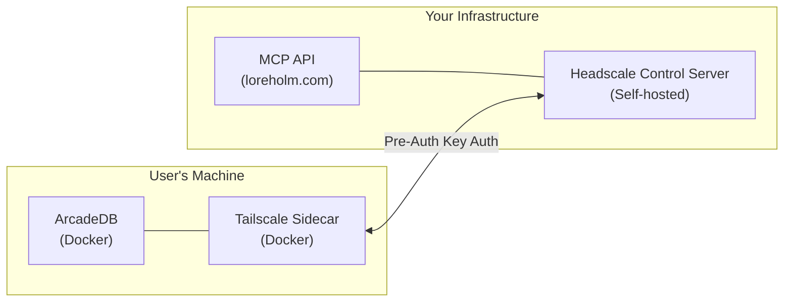

# Headscale Setup Guide

Headscale is your self-hosted Tailscale control plane. It manages the private mesh network that connects user databases to your API.

## What is Headscale?

- **Self-hosted alternative to Tailscale's coordination server**
- **Manages device authentication and routing**
- **Required for BYODB architecture**

## Deployment Options

### Option 1: Automated via GitHub Actions (Recommended)

Run the Headscale setup workflow from GitHub Actions:

1. Go to **Actions** → **Setup Headscale** → **Run workflow**
2. The workflow will:
   - Deploy the Headscale container
   - Generate an API key
   - Store the key on the server at `/opt/mcp-cloud/.headscale_api_key`
   - Update the local `.env` file
3. Copy the `HEADSCALE_API_KEY` from the workflow output to GitHub Secrets
4. Set `HEADSCALE_API_URL=http://headscale:8080` in GitHub Secrets
5. Re-run the main deployment workflow

### Option 2: Same VM as API (Manual)

Deploy Headscale alongside your MCP API:

```bash
# On your VM
cd /opt/mcp-cloud
docker-compose -f deploy/docker-compose.headscale.yml up -d
```

**HEADSCALE_API_URL would be:** `http://headscale:8080` (internal Docker network)

### Option 2: Separate Server

Deploy Headscale on a different server for isolation:

```bash
# On headscale server
docker run -d \
  --name headscale \
  -p 8080:8080 \
  -p 50443:50443 \
  -v headscale_data:/var/lib/headscale \
  headscale/headscale:latest \
  serve
```

**HEADSCALE_API_URL would be:** `https://headscale.yourdomain.com` (or internal IP)

### Option 3: Headscale Cloud (If it exists)

Use a managed Headscale service if available.

## Initial Setup

### 1. Initialize Headscale

After starting the container:

```bash
# Create initial config
docker exec headscale headscale config generate > /opt/mcp-cloud/headscale.yaml

# Edit the config to set your domain
# server_url: https://YOUR_DOMAIN:50443
```

### 2. Create API Key

This is what you need for `HEADSCALE_API_KEY`:

```bash
# Generate an API key
docker exec headscale headscale apikeys create

# Example output:
# API key: hskey-aBcDeFgHiJkLmNoPqRsTuVwXyZ1234567890
```

**Save this key** - it's your `HEADSCALE_API_KEY` secret!

### 3. Create First User (Namespace)

Test that it works:

```bash
# Create a test user
docker exec headscale headscale users create testuser

# List users
docker exec headscale headscale users list
```

### 4. Generate Pre-Auth Key (Test)

```bash
# Create a pre-auth key for testing
docker exec headscale headscale preauthkeys create --user testuser

# Example output:
# PreAuthKey: preauthkey-abc123...
```

## Configuration Summary

After setup, you'll have:

```bash
# GitHub Secrets
HEADSCALE_API_URL=http://headscale:8080    # If same VM
                                           # OR https://headscale.domain.com

HEADSCALE_API_KEY=hskey-YOUR_KEY_HERE     # From step 2 above
```

## Network Architecture



## Security Notes

1. **API Server (port 8080)** - Internal only, not exposed to internet
2. **gRPC Server (port 50443)** - Exposed for Tailscale clients to connect
3. **API Key** - Keep secret, has full admin access
4. **Pre-Auth Keys** - One-time use, expire after 1 hour by default

## ACL Configuration (User Isolation)

**IMPORTANT**: By default, all nodes on the Headscale network can see each other. This means User A could potentially access User B's database. To prevent this, you must configure ACLs.

### Deploy ACL Policy

The ACL policy file (`deploy/headscale-acl.hujson`) ensures:
- ✅ API can reach the user's local dashboard query proxy (`4466`) for multi-database routing
- ✅ API can reach local sync endpoint (`8081`) on user nodes
- ❌ Users CANNOT reach other users' databases
- ❌ End hosts cannot reach the API over the tailnet

```bash
# Copy the ACL and config files to the server
scp deploy/headscale-acl.hujson your-server:/opt/mcp-cloud/headscale/config/acl.hujson
scp deploy/headscale-config.yaml your-server:/opt/mcp-cloud/headscale/config/config.yaml

# Restart Headscale to apply
docker restart headscale
```

### Verify ACLs are Active

```bash
# Check ACL policy is loaded
docker exec headscale headscale debug acl

# You should see the policy rules, not "ACL policy not configured"
```

### ACL Policy Explained

```json
{
  "groups": {
    "group:api": ["admin"]  // API service runs in 'admin' namespace
  },
  "acls": [
    // API can reach member nodes on allowed ports only
    { "src": ["group:api"], "dst": ["autogroup:member:4466", "autogroup:member:8081"] }

    // Everything else is DENIED by default
  ]
}
```

## Alternative: Skip Headscale for MVP

If Headscale setup is too complex right now, you can:

1. **Use Tailscale's official control plane** (tailscale.com)
2. Generate pre-auth keys manually from Tailscale admin console
3. Store them in your database
4. Serve them to users on signup

This requires users to have a Tailscale account or you to create them.

## Troubleshooting

### Check Headscale is running
```bash
docker logs headscale
curl http://localhost:8080/health
```

### List all users
```bash
docker exec headscale headscale users list
```

### Check API key works
```bash
curl -H "Authorization: Bearer hskey-YOUR_KEY" \
  http://localhost:8080/api/v1/user
```

## Next Steps

Once Headscale is deployed:
1. Add `HEADSCALE_API_URL` to GitHub secrets
2. Add `HEADSCALE_API_KEY` to GitHub secrets
3. Deploy the backend onboarding routes
4. Test the full flow from frontend
