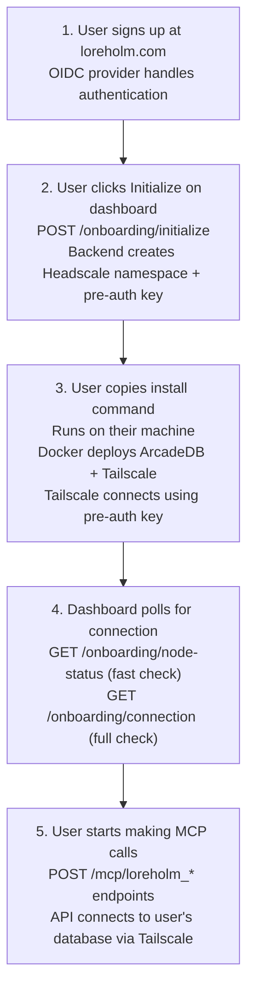

# Onboarding API Reference (3 min read)

The onboarding API manages user registration, database provisioning, and connection status for BYODB mode.

## Authentication

All onboarding endpoints require a valid OIDC JWT token:

```
Authorization: Bearer <jwt-token>
```

## Endpoints

### POST /onboarding/initialize

Initialize onboarding for a new user. Creates a Headscale pre-auth key.

**Request:**
```json
{
  "node_name": "my-workstation"  // Optional
}
```

**Response:**
```json
{
  "user_id": "a1b2c3d4-e5f6-7890-abcd-ef1234567890",
  "pre_auth_key": "preauthkey-abc123...",
  "install_command": "curl -fsSL loreholm.com/install.sh | bash -s -- --key preauthkey-abc123...",
  "expires_at": "2026-01-31T13:00:00Z"
}
```

### GET /onboarding/status

Get the current onboarding status for the authenticated user.

**Response:**
```json
{
  "user_id": "a1b2c3d4-e5f6-7890-abcd-ef1234567890",
  "email": "user@example.com",
  "initialized": true,
  "node_name": "my-workstation",
  "node_count": 1,
  "last_seen": "2026-01-31T12:30:00Z",
  "status": "connected",
  "install_command": "curl -fsSL ...",
  "node_connected": true,
  "database_connected": true,
  "update_command": "curl -fsSL loreholm.com/update.sh | bash"
}
```

**Status Values:**
- `pending` - Initialized but no node connected yet
- `connected` - Node online and database accessible
- `disconnected` - Node was connected but is now offline

### GET /onboarding/node-status

Check if user has a node registered in Headscale. Fast check, doesn't test database connectivity.

**Response:**
```json
{
  "user_id": "a1b2c3d4-e5f6-7890-abcd-ef1234567890",
  "node_connected": true,
  "tailscale_ip": "100.64.1.5",
  "namespace": "user-abc123"
}
```

### GET /onboarding/connection

Full connection check - verifies node registration AND database connectivity.

**Response (Success):**
```json
{
  "user_id": "a1b2c3d4-e5f6-7890-abcd-ef1234567890",
  "namespace": "user-abc123",
  "connected": true,
  "node_connected": true,
  "database_connected": true,
  "tailscale_ip": "100.64.1.5",
  "details": {
    "latency_ms": 45,
    "arcadedb_version": "25.11.1"
  }
}
```

### GET /onboarding/local-dashboard/resolve

Resolve the user's LAN local dashboard URL at runtime by querying metadata from their BYODB node over Tailscale. The local dashboard exposes a link to the ArcadeDB Studio UI (port 2480) for each deployed database from its own web UI.

**Response:**
```json
{
  "user_id": "a1b2c3d4-e5f6-7890-abcd-ef1234567890",
  "tailscale_ip": "100.64.1.5",
  "url": "http://192.168.1.20:3000/",
  "local_admin_url": "http://192.168.1.20:4466/",
  "resolved": true
}
```

**Response (Failure):**
```json
{
  "user_id": "a1b2c3d4-e5f6-7890-abcd-ef1234567890",
  "namespace": "user-abc123",
  "connected": false,
  "node_connected": true,
  "database_connected": false,
  "error": "Connection refused"
}
```

### POST /onboarding/regenerate

Generate a new pre-auth key (invalidates previous key).

**Response:**
```json
{
  "user_id": "a1b2c3d4-e5f6-7890-abcd-ef1234567890",
  "pre_auth_key": "preauthkey-new123...",
  "install_command": "curl -fsSL loreholm.com/install.sh | bash -s -- --key preauthkey-new123...",
  "expires_at": "2026-01-31T14:00:00Z"
}
```

## User Flow



## Error Handling

| Status | Code | Description |
| --- | --- | --- |
| 401 | `UNAUTHORIZED` | Missing or invalid JWT token |
| 404 | `NOT_INITIALIZED` | User hasn't called /initialize yet |
| 500 | `HEADSCALE_ERROR` | Failed to communicate with Headscale |
| 503 | `DATABASE_UNAVAILABLE` | User's database is not reachable |

## Environment Variables

The onboarding router requires:

```bash
# OIDC JWT validation (any provider; endpoints are discovered from the issuer)
OIDC_ISSUER=https://your-tenant.us.auth0.com
OIDC_AUDIENCE=https://api.loreholm.com
# OIDC_AUDIENCE_CLAIM=azp   # optional: if your provider carries the API in azp

# Headscale API
HEADSCALE_API_URL=http://headscale:8080
HEADSCALE_API_KEY=hskey-...

# Install script generation
PUBLIC_API_HOST=https://loreholm.com

# Optional local-dashboard resolver overrides
LOCAL_DASHBOARD_RESOLVER_PORT=8081
LOCAL_DASHBOARD_RESOLVER_PATH=/local-dashboard.json
```

## Development Mode

When `OIDC_ISSUER` is not set, the API runs in development mode:
- JWT validation is skipped
- Mock user ID is used
- Mock pre-auth keys are generated
